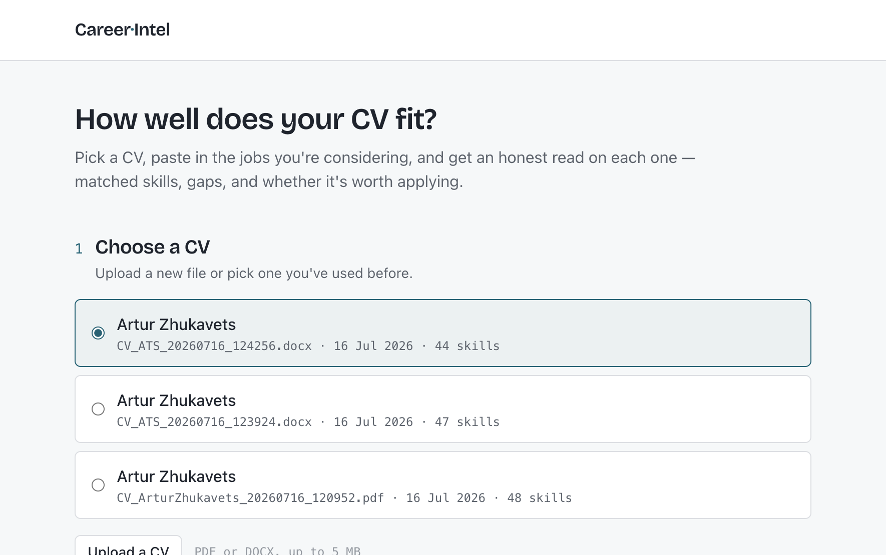
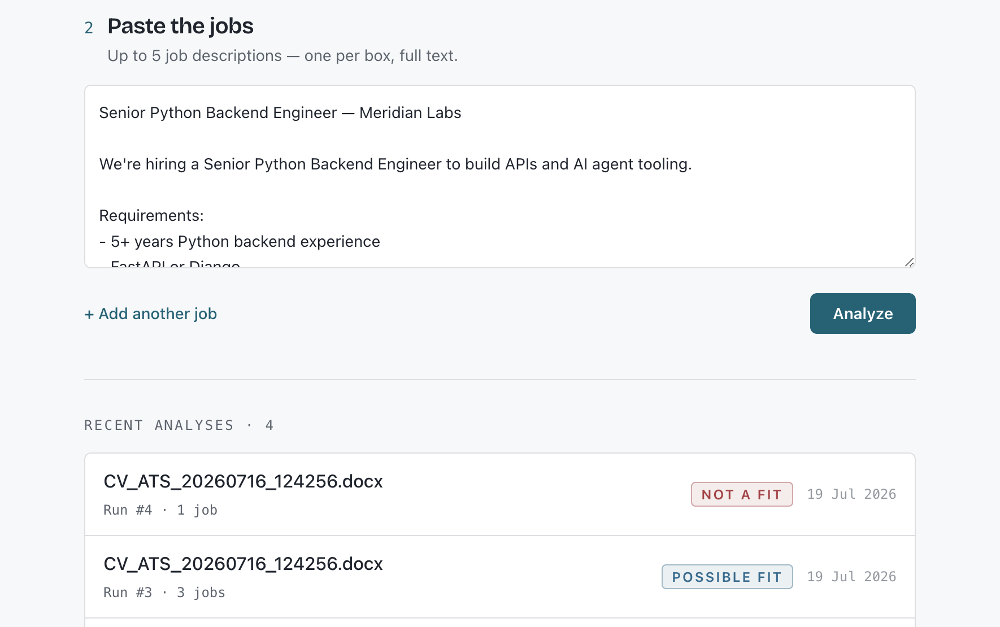
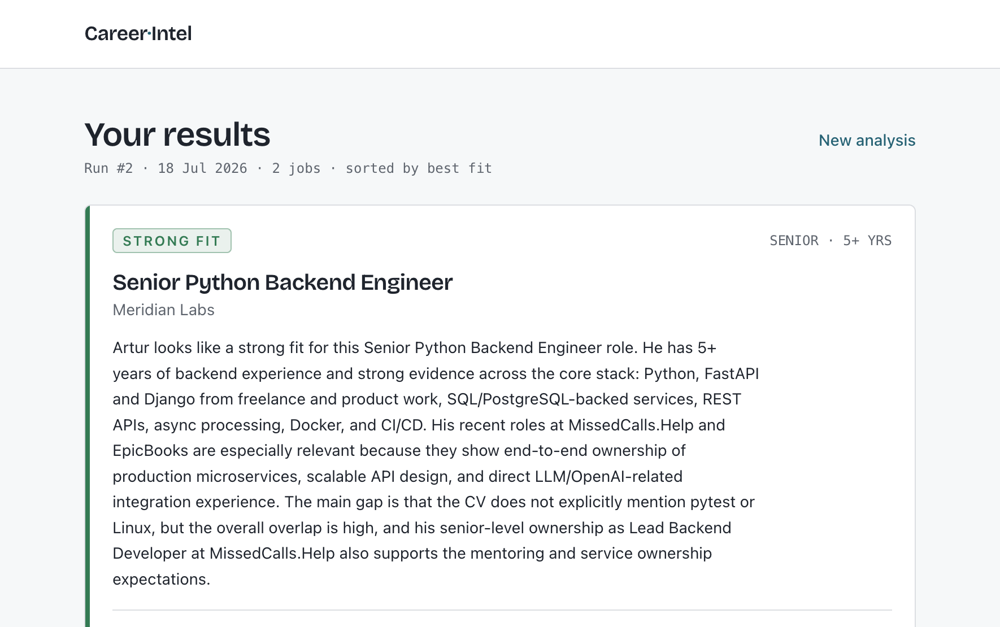
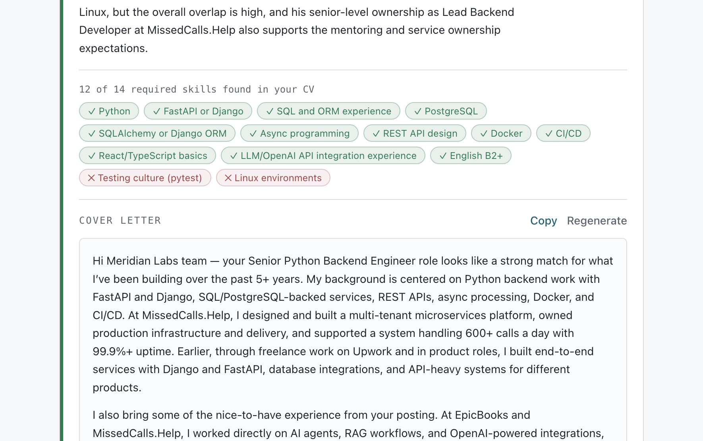
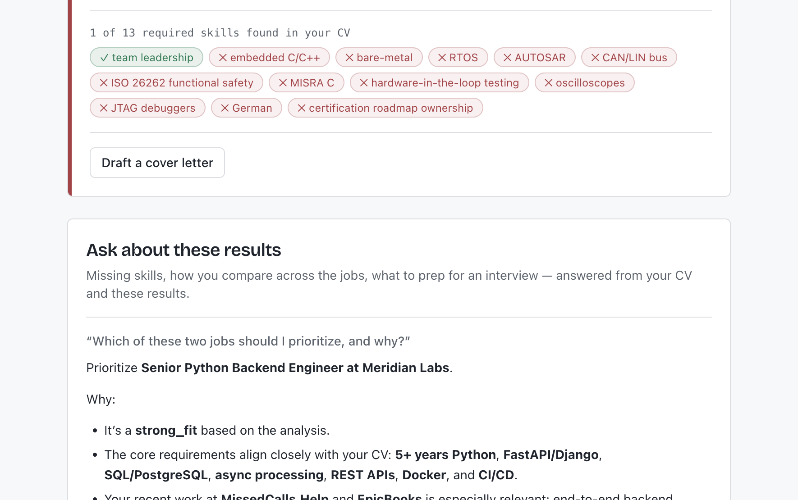
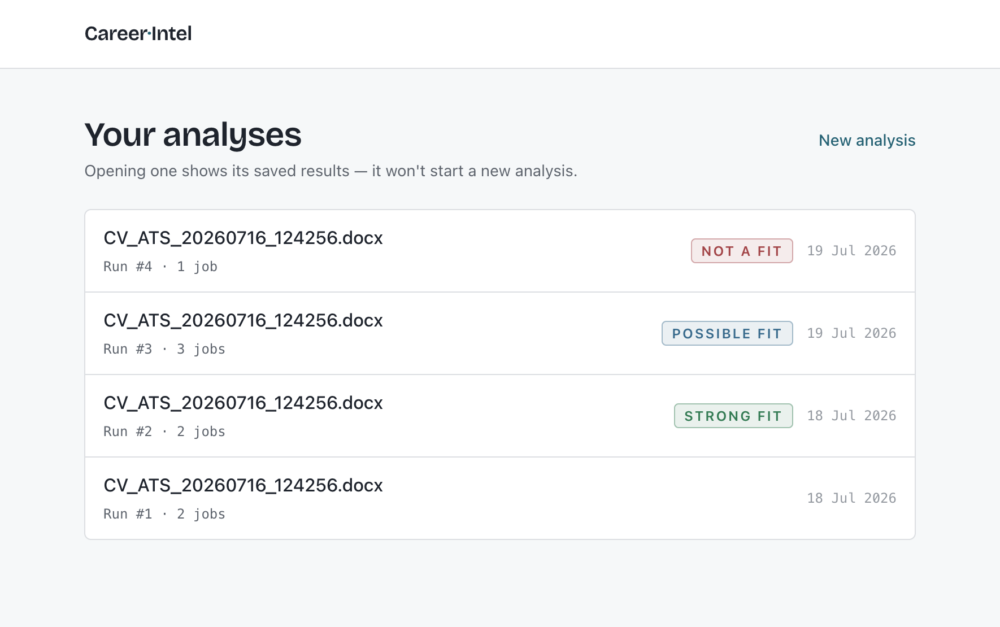
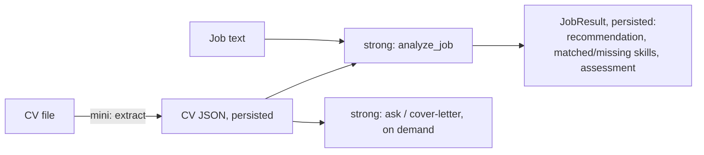

# Career Intelligence Assistant

Analyzes one CV against up to 5 job postings. For each job it returns a fit
recommendation, matched vs. missing skills, and a written verdict, plus free-form
Q&A over the run and a per-job cover letter. Results are persisted, so reopening a
past run costs zero LLM calls.

## a. Quick setup

Requires Docker and an OpenAI API key.

```bash
cp .env.example .env      # set OPENAI_API_KEY
./run.sh                  # docker compose build + up  → http://localhost:8000
./stop.sh                 # tear down
```

Local dev (without Docker):

```bash
# backend  (Python 3.13, uv)
cd backend && uv run main.py                 # → :8000

# frontend (Vite dev server, proxies /api → :8000)
cd frontend && npm install && npm run dev    # → :5173
```

`.env` keys: `OPENAI_API_KEY`, `OPENAI_MODEL` (cheap tier, default `gpt-5.4-mini`),
`OPENAI_STRONG_MODEL` (strong tier, default `gpt-5.4`), `APP_PORT`.

Open the app at [http://localhost:5173](http://localhost:5173) (local) or [http://localhost:8000](http://localhost:8000) (Docker).

## How to use

**1. Choose a CV.** Upload a PDF/DOCX, or pick one you've used before.



**2. Paste jobs & analyze.** Up to 5 full job descriptions, then hit Analyze.



**3. Read the results.** Each job gets a fit verdict, a written assessment, and matched/missing skills (sorted best-fit first).



**4. Draft a cover letter** per job, on demand. Copy or regenerate.



**5. Ask follow-ups.** Free-form Q&A grounded in your CV and this run's results.



**6. Reopen past runs.** History (or Recent analyses on the home page) opens saved results with no new LLM calls.



## b. Architecture overview

```
                         ┌──────────────────────────────┐
  Browser (React SPA) ──►│ nginx (serves SPA + proxies)  │
                         └───────────────┬──────────────┘
                                         │ /api
                                 ┌───────▼────────┐        ┌──────────────┐
                                 │ FastAPI backend│──────► │  OpenAI API  │
                                 │  (async)       │        │ mini + strong│
                                 └───┬───────┬────┘        └──────────────┘
                                     │       │
                          ┌──────────▼─┐  ┌──▼──────────────┐
                          │  SQLite     │  │ data_dir (disk) │
                          │ (aiosqlite) │  │ original uploads│
                          └─────────────┘  └─────────────────┘
```

Data model: `Resume → Run → (Job, JobResult)`. A **Run** is the unit of history:
one CV + N jobs at a point in time.

Two-stage LLM flow, split on purpose:



- **PDFs** go to the model as raw files (vision handles scans/layout). **DOCX** text
is extracted locally with `python-docx` (capped by `max_docx_chars`) and never
persisted; re-running just re-reads the file.
- Only `parsed_json` lives in the DB; the original upload stays on disk.

**Stack.** Backend: FastAPI · async SQLAlchemy 2.0 + aiosqlite (SQLite) ·
pydantic-settings · OpenAI SDK (`responses.parse` structured outputs) · `uv`.
Frontend: Vite · React 19 + TS · Tailwind v4 (CSS-first) · TanStack Query v5 ·
react-router. Deployment: Docker Compose (nginx + backend), same-origin, no CORS.

Endpoints: `POST /api/resume/upload`, `GET /api/resume`, `POST /api/runs`,
`GET /api/runs`, `GET /api/runs/{id}`, `POST /api/runs/{id}/ask`,
`POST /api/jobs/{id}/cover-letter`.

## c. Productionizing on a hyperscaler  


The current build is a single-node Compose stack with SQLite and in-process
analysis, deliberately simple for the scope. To productionize and scale (e.g. on AWS):

- **Compute:** containers already exist; run them on ECS Fargate / Cloud Run / a
managed k8s. Backend is stateless once the DB and files move off-box, so it scales
horizontally behind an ALB.
- **Database:** swap SQLite for managed Postgres (RDS/Aurora). The code already uses
async SQLAlchemy, so this is mostly a driver + URL change (`asyncpg`).
- **File storage:** move `data_dir` uploads from local disk to S3 (or GCS/Blob) so
any replica can read them; serve via presigned URLs.
- **Long-running analysis:** move `analyze_run` off the request path onto a queue
(SQS + a worker, or Cloud Tasks). Return a `run_id` immediately; the SPA polls or
subscribes for results. This removes request-timeout risk on large batches.
- **Secrets & config:** API keys via Secrets Manager / Parameter Store, not `.env`.
- **Edge & delivery:** SPA to S3 + CloudFront (or Cloudflare Pages); keep the API
same-origin behind the CDN to preserve the no-CORS posture.
- **Ops:** structured request/LLM logging to CloudWatch, per-run cost/latency
metrics, alarms on OpenAI error/latency, autoscaling on queue depth.
- **Cost & safety at scale:** per-user rate limits and spend caps, response caching
by CV+job hash, and auth/multi-tenancy (currently none).


## d. RAG / LLM approach & decisions

**No RAG, no embeddings, no vector DB, on purpose.** A CV plus a handful of job
postings is small (roughly 10-15k tokens) and fits in one context window, so there is
nothing to retrieve. Instead I parse each input into **structured JSON up front** and
pass that JSON straight to the model. Chunking a two-page CV would only fragment the
role-to-date-to-skill relationships the analysis relies on, and structured JSON is
denser than retrieved text, so every call stays cheaper and grounded in the same
canonical view. Skill matching (React vs ReactJS, Django as a "Python web framework")
is judged semantically inside the analysis call, so an embedding index would buy
nothing.

**Models:** a cheap model (`gpt-5.4-mini`) for CV extraction and a strong model
(`gpt-5.4`) for job analysis, Q&A, and cover letters. Cheap where the task is
mechanical, strong where judgment matters. I rejected a single strong model
everywhere (wasteful for extraction) and local/OSS models (PDF vision and reliable
structured output mattered more than self-hosting here).

**Embedding model, vector DB, orchestration framework:** none. The flow is a few
explicit async functions; LangChain/LlamaIndex would add abstraction without paying
for itself at this size.

**Prompt & context management:** prompts are versioned as markdown files in
`backend/prompts/` and loaded once at startup. Every call uses structured outputs
(`responses.parse` + Pydantic), so the line between LLM judgment and typed data the
app relies on is enforced by the schema, not by parsing free text.

**Guardrails:** the app owns facts (which skills overlap, what gets persisted); the
LLM only judges what gaps mean, never scoring. Extraction returns
`is_valid_resume` / `is_valid_job_posting` with a `rejection_reason`, so non-CVs and
non-postings are flagged before any expensive work. Prompts require the model to cite
only roles present in the CV JSON and to invent no skills on either side.

**Quality & observability:** quality rests on the schema-validated outputs and the
deterministic/LLM split. Full observability (per-run trace IDs, token/cost/latency
accounting) and an automated eval set are designed but not yet built.

## e. Key technical decisions I made and why

I chose to break the work into several small, independent LLM calls instead of one big
prompt. CV parsing is its own call that returns structured JSON I can store and reuse.
Analyzing a CV against a specific job is a separate call whose result is also stored in
structured form, so it can be reopened and reused later. This means more calls overall,
but each one carries a much smaller context, which actually wins on token usage. Being
able to save and reuse results is one of the core features of this project.

I also decided against an embeddings model for skill comparison. It felt like overkill
for this scope, so I left that judgment to the LLM, and after several checks I was
confident it handles the matching well.


## f. Engineering standards

Followed: typed end-to-end (Python type hints everywhere; TS strict, no `any`);
frontend/backend contract mirrored 1:1 (`frontend/src/api/types.ts` ↔
`backend/schemas/`); a single API layer on the frontend (`src/api/`); deterministic
logic kept as pure, API-key-free functions; minimal comments, names carry meaning;
config via env/pydantic-settings, no secrets in code; reproducible builds (`uv` lock,
Docker).

Skipped (scope/time): automated test suite and CI, structured logging/observability,
auth & multi-tenancy, DB migrations (schema created on startup), rate limiting.

Deployment is intentionally plain: a single remote server running the app through
nginx and Docker Compose.

## g. How I used AI tools in development

I used Claude Code to talk through and shape the final architecture before writing much
code. For the actual implementation I leaned on Cursor, mostly because its diff view
after each AI change lets me review and control what actually lands in the repo.

To keep this repeatable and maintainable, I keep a project rules file (`CLAUDE.md`) that
pins the stack and conventions so the assistant stays consistent across sessions. My
rule of thumb: let AI draft mechanical or boilerplate code and explore options, but
review every diff myself and never let it own the deterministic logic (scoring, skill
matching) or design decisions.


## h. What I'd do differently with more time

1. Add auth so data isn't shared between users, or at least scope it to a browser session.
2. Iterate on and refine the prompts.
3. Validate user input on the way in.
4. Polish the UI.
5. Add a common parsing layer for incoming CV files (today only `.pdf` and `.docx`, each with its own handler).


## i. Note

I tried to keep this project honest to its scope: a small, working tool built well
rather than a large one built half-way. The decisions I'm happiest with are the ones
about what to leave out (no RAG, no vector DB, no orchestration framework), because
they kept the codebase simple and easy to reason about. Where I used AI it was to move
faster on the parts that don't need my judgment, and the trade-offs and reasoning above
are my own.

